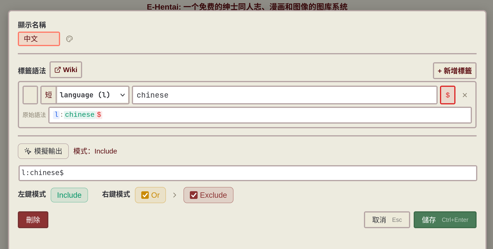
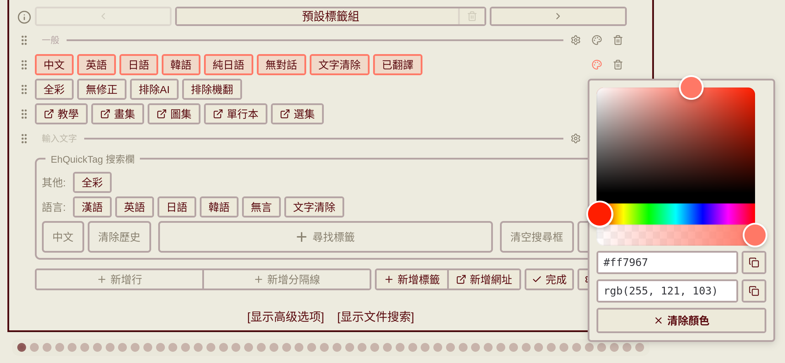

# EhQuickTag

[繁體中文](README.zh-TW.md) | [Sleazy Fork](https://sleazyfork.org/zh-TW/scripts/578820-eh-quick-tag)

> ⚠️ Early development. Data formats (profiles, settings, etc.) may change in future versions and require reconfiguration.

[Kooha-2026-06-22-21-23-13.webm](https://github.com/user-attachments/assets/f3db2250-dc81-4e15-b50c-1555502debbb)

A customizable quick tag bar for E-Hentai / ExHentai search.

Adds a quick tag bar above the search box for one-click condition assembly. A companion search panel renders the current search terms as clickable buttons that can be dragged back into the tag bar, and keeps cross-page search history.

## Features

### Quick tag bar

- **Three-state toggle**: Each button cycles through Include / OR / Exclude, synced with the native search box in real time; left and right click can each be configured independently
- **Line layout**:
  - Two row types — tag rows and separator rows — freely interleaved
  - Rows can be reordered and colored; tags can be dragged across rows
  - Separator rows support label, line style (solid / dashed / none), line position (top / middle / bottom), line length & thickness, text size, and text alignment
- **URL buttons**: Pin frequently used search pages, with auto-fetch of page titles
- **Background double-click**: Left/right double-click on the tag bar background triggers search or clears the search box; actions are configurable

### Search panel

- **Visualize the current search**: Breaks the contents of the search box into buttons, with one-click Include / OR / Exclude switching
- **Drag back into the tag bar**: Drop a frequently used term into the tag bar to make it a permanent button
- **Cross-page search history**: Searched terms are remembered across pages and recallable in one click; can be disabled for privacy
- **Toolbar**: Search, clear search box, clear history, and "+ Browse tags" (pick from the tag database and add to the current search)
- **Display language**: Auto / Chinese-English toggle / English-only; the "toggle" mode adds a 中／EN switch button

### Tag database search

- Integrates [EhTagTranslation](https://github.com/EhTagTranslation/Database) — search in Traditional/Simplified Chinese, Japanese, or English
- **Popularity-weighted suggestions**: Tags ranked by gallery count — e-hentai per-namespace for f/m/x/o/language, nhentai per-namespace for artist/character/parody/group
- **OpenCC Simplified-to-Traditional**: Choose Auto / Traditional / Simplified (DB original) for Chinese tag labels
- **Namespace order & visibility**: Customize namespace ranking; hide categories you don't care about
- **Database mirror & cache**: Choose a CDN mirror, adjust cache TTL, or refresh manually

### Tag button configuration



- **Full syntax editor**: namespace (long/short form), qualifier, exact match (`$`), wildcard (`*`), and more
- **Display name**: Separate from the underlying tag syntax — show whatever label you want on the button
- **Click cycle editor**: Visually edit the state cycle for each mouse button; shapes that can't be expressed in EH search syntax are flagged

### Appearance



- **Four button style presets**: Default, bottom shadow, offset shadow, pushable
- **Two-layer coloring**: Color rows, color buttons individually, and optionally force the include state to always render green
- **Custom font**: Pick a font-family and weight that only applies inside the tag bar

### Profiles

- Multiple independent profiles, one-click switch, reorderable and renameable
- **Trash**: Deleted profiles can be restored or permanently purged
- **JSON editor**: Import / export profile data directly; unparseable data is collected under "corrupted data"
- **Persistent storage**: Backed by GM storage, compatible with Tampermonkey backup/sync

### Sites & languages

- Supports both **e-hentai.org** and **exhentai.org**
- UI languages: **Traditional Chinese, Simplified Chinese, English, Japanese**

## Install

Requires [Tampermonkey](https://www.tampermonkey.net/) or a compatible userscript manager. Install from [Sleazy Fork](https://sleazyfork.org/zh-TW/scripts/578820-eh-quick-tag) or [GitHub Releases](https://github.com/Tsuyumi25/EhQuickTag/releases).

## Development

```bash
git clone https://github.com/Tsuyumi25/EhQuickTag.git
cd EhQuickTag
pnpm install
pnpm dev       # Start dev server; the browser will auto-install the dev userscript
pnpm build     # Output dist/eh-quick-tag.user.js
```

## Tech Stack

- TypeScript + Vue 3 + Vite
- [vite-plugin-monkey](https://github.com/lisonge/vite-plugin-monkey)
- [vuedraggable](https://github.com/SortableJS/vue.draggable.next)

## Credits

- [EhTagTranslation/Database](https://github.com/EhTagTranslation/Database) — Tag translation database (CC BY-NC-SA 3.0)
- [EhSyringe](https://github.com/EhTagTranslation/EhSyringe) — Search ranking logic reference (MIT)
- [OpenCC](https://github.com/BYVoid/OpenCC) — CJK character mapping data (Apache-2.0)

## Inspiration

- [Add button on exhentai searchbox](https://sleazyfork.org/scripts/454282)
- [ExAdvancedSearchMemo](https://sleazyfork.org/scripts/454209)
- [Lolicon E-Hentai/ExHentai Enhancer](https://sleazyfork.org/scripts/516145)
- [Exhentai-Enhancer](https://github.com/sk2589822/Exhentai-Enhancer) — Tech stack reference

## License

MIT
