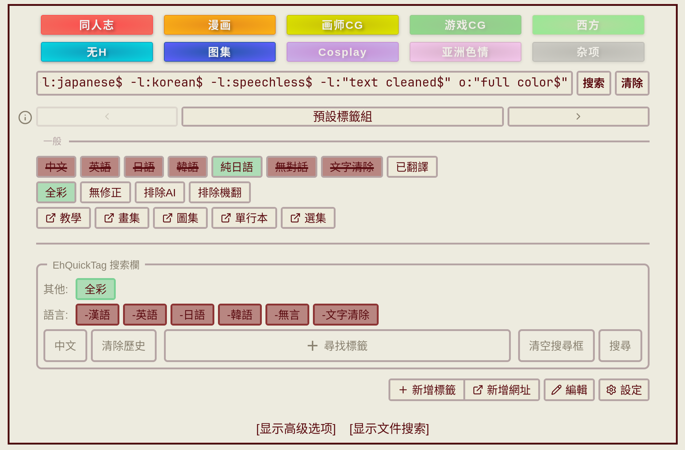

# EhQuickTag

[English](README.md)

E-Hentai / ExHentai 搜尋快捷標籤列。

在搜尋框上方加入可自訂的快捷標籤列，點擊即可組合搜尋條件，支援標籤資料庫搜尋、多標籤組切換、拖曳排序。



## 功能

- **快捷標籤列**：點擊切換三態（加入 / OR / 排除），即時高亮與搜尋框同步
- **標籤資料庫搜尋**：整合 [EhTagTranslation](https://github.com/EhTagTranslation/Database)，輸入中文（繁/簡）、日文、英文搜尋標籤，支援 nhentai 人氣權重排序
- **多標籤組**：建立多組標籤配置，快速切換，支援回收桶與 JSON 編輯器
- **網址按鈕**：自訂常用搜尋頁面的快捷連結
- **拖曳排序**：標籤可跨行拖曳，整行排序，標籤組排序
- **背景雙擊搜尋**：左/右鍵雙擊 tag bar 背景觸發搜尋，動作可自訂
- **自訂字體**：自選 font-family 與字重
- **資料持久化**：存於 GM storage，支援 Tampermonkey 備份/同步
- **同時支援** e-hentai.org 與 exhentai.org
- **多語言**：繁體中文、簡體中文、英文、日文

## 安裝

需要 [Tampermonkey](https://www.tampermonkey.net/) 或相容的 userscript 管理器。

- [Sleazy Fork](https://sleazyfork.org/zh-TW/scripts/578820-eh-quick-tag)
- [GitHub Releases](https://github.com/Tsuyumi25/EhQuickTag/releases)

> ⚠️ 開發中，資料格式（標籤組、設定等）在未來版本可能不相容，屆時可能需要重新設定。

## 開發

```bash
git clone https://github.com/Tsuyumi25/EhQuickTag.git
cd EhQuickTag
pnpm install
pnpm dev       # 啟動 dev server，瀏覽器會自動安裝開發用 userscript
pnpm build     # 產出 dist/eh-quick-tag.user.js
```

## 技術棧

- TypeScript + Vue 3 + Vite
- [vite-plugin-monkey](https://github.com/lisonge/vite-plugin-monkey)
- [vuedraggable](https://github.com/SortableJS/vue.draggable.next)

## 致謝

- [EhTagTranslation/Database](https://github.com/EhTagTranslation/Database) — 標籤中文翻譯資料庫（CC BY-NC-SA 3.0）
- [EhSyringe](https://github.com/EhTagTranslation/EhSyringe) — 搜尋排序權重邏輯參考（MIT）
- [OpenCC](https://github.com/BYVoid/OpenCC) — 繁簡轉換字表資料（Apache-2.0）

## 靈感來源

- [Add button on exhentai searchbox](https://sleazyfork.org/scripts/454282)
- [ExAdvancedSearchMemo](https://sleazyfork.org/scripts/454209)
- [Lolicon E-Hentai/ExHentai Enhancer](https://sleazyfork.org/scripts/516145)
- [Exhentai-Enhancer](https://github.com/sk2589822/Exhentai-Enhancer) — 技術棧參考

## 授權

MIT
